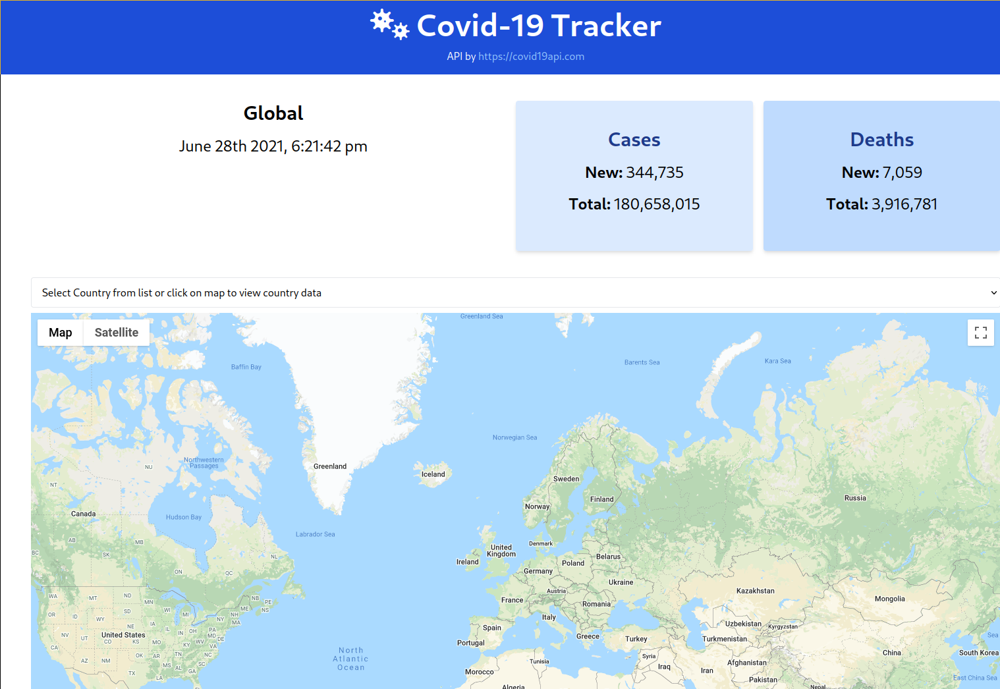

# vue-covid-tracker

Application created with VueJS and TailwindCSS to display covid-19 stats of cofirmed cases and confirmed deaths globally and by country.
[View demo](https://mysterious-brook-20381.herokuapp.com/)


## Project setup
```
npm install
```

### Compiles and hot-reloads for development
```
npm run serve
```

### Compiles and minifies for production
```
npm run build
```

### Customize configuration
See [Configuration Reference](https://cli.vuejs.org/config/).
